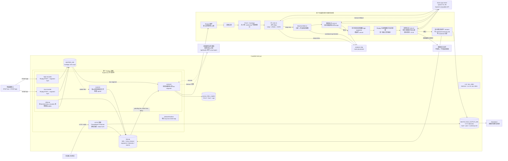

# Mine NAS AI Video Architecture

下面这张图对应当前 `main` 分支的实现。箭头表示数据流，虚线表示控制、状态或查询。



## 如何阅读

1. **录像层**：摄像头同时输出 low 和 high 两路 RTSP。两个 ffmpeg recorder 各自把视频切成约120秒文件。`RECORD_WINDOW_START/END` 外会停止拉流。
2. **索引层**：scanner 只把稳定的 mp4 登记到 SQLite；analyzer 只处理 `analysis_stream_role=low` 的待处理片段，并故意等待 `ANALYSIS_DELAY_SECONDS`。
3. **本地预过滤层**：OpenCV DNN 运行 YOLO、脸部检测和年龄分类。黑帧、无人物、确定只有成人的片段不会调用 VLM。
4. **主判断层**：Qwen3-VL 查看低流抽样帧，返回 `keep`、置信度、标题、摘要和片段偏移。
5. **候选确认层**：主判断为正面后，重新抽取候选附近的高分辨率帧，进行第二次 VLM 确认。
6. **最终视频层**：根据 low 的时间偏移找到所有重叠 high 文件，生成隐藏暂存视频，再从暂存视频抽取前、中、后三帧进行第三次确认。只有这里通过后才发布到 Nextcloud 目录。
7. **持久化层**：发布后写视频、JSON 元数据、每日 `summary.md`，再写 SQLite `moments` 记录。配额淘汰也延迟到新视频成功登记后执行。

## 当前一次正面片段的 VLM 成本

正常情况下，一个最终保存的片段会产生三次 VLM 请求：

| 阶段 | 输入 | 目的 |
| --- | --- | --- |
| 主分析 | 4 张 384px low 帧 | 判断是否值得保存、确定时间范围 |
| 候选验证 | 3 张 512px low 候选帧 | 防止主模型误判时间或人物 |
| 最终验证 | 暂存 high 视频的 3 帧 | 确认实际准备发布的视频不是空片段 |

主分析为负面的片段不会进入后两步。VLM 超时会先尝试联系表回退；连续超时会触发 analyzer 熔断，避免 NAS 无限堆积请求。

## 主要目录和记录

```text
BUFFER_DIR/
  <camera>/low/*.mp4       # 分析源，过 RETENTION_HOURS 后清理
  <camera>/high/*.mp4      # 原始高质量源，过 RETENTION_HOURS 后清理

NEXTCLOUD_OUTPUT_DIR/
  2026-07-15/
    083351_child-walking.mp4
    083351_child-walking.json
    summary.md

DATABASE_PATH
  segments                    # 原始片段索引与分析状态
  moments                     # 已发布视频记录
  events                      # skip/error/verification/cap 事件
```

`CAMERA_TIME_OFFSET_SECONDS` 只修正展示时间、文件名、JSON 和配额日期，不改变 ffmpeg 在源文件内的相对截取偏移。对于示例中摄像头时间比 NAS 慢约23秒的情况，应设置为 `-23`。
